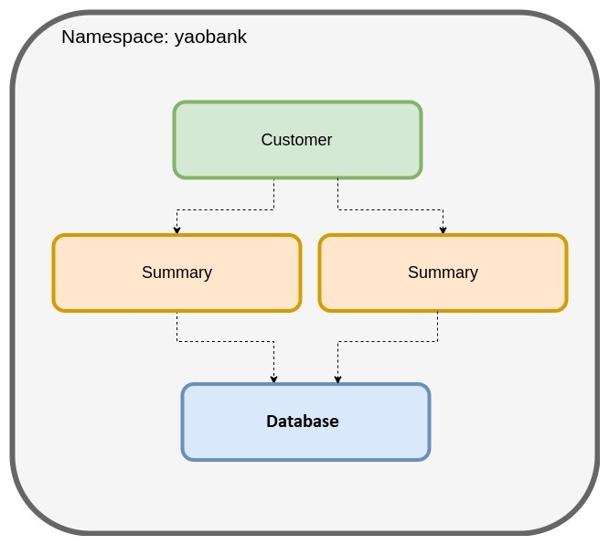

# 1. Installing Calico on K8s

The first lab guides you through the process of installing Calico and deploying a sample application. 

In this lab, you will: \
1.1. Install Calico \
1.2. Launch a sample application (Yaobank) \
1.3. Access the application


## 1.1. Install Calico

Your lab consists of a cluster of three nodes with a single master, and a bastion host from where you access the environment and simulate external connectivity. Kubernetes has been preinstalled, but as your network plugin is not there yet, your nodes will appear as NotReady:

```
$ kubectl get nodes
NAME           STATUS   ROLES                  AGE   VERSION
ip-10-0-1-20   NotReady    control-plane,master   3m   v1.20.6
ip-10-0-1-30   NotReady    <none>                 3m   v1.20.6
ip-10-0-1-31   NotReady    <none>                 3m   v1.20.6
```

Calico will be the networking (CNI) and network policy implementation throughout your training lab. To install Calico, we will use an operator, so it will implement and automate the lifecycle of our calico deployment, but first, let's create the necessary custom resources, and pass the configuration options through a manifest. Check the file 1-custom-resources.yaml in the manifest folder for this lab:

```
apiVersion: operator.tigera.io/v1
kind: Installation
metadata:
  name: default
spec:
  # Configures Calico networking.
  calicoNetwork:
    # Note: The ipPools section cannot be modified post-install.
    ipPools:
    - blockSize: 26
      cidr: 10.48.0.0/24
      encapsulation: None
      natOutgoing: Enabled
      nodeSelector: all()
```

As you can see, we have defined a pool with the CIDR 10.48.0.0/24. This must be within the range of the pod CIDR when we installed Kubernetes. Here we are defining a smaller subnet within the available range as we will be creating additional pools for other purposes in future labs. Before applying the customer resources and config, let's download and implement the lastest version available for the operator:

```
kubectl create -f https://docs.tigera.io/manifests/tigera-operator.yaml
```

Check the operator has been successfully rolled out:

```
kubectl rollout status -n tigera-operator deployment tigera-operator
```
Now, we can apply the manifest which will create the customer resources and needed config:

```
kubectl create -f 1-custom-resources.yaml
```

And confirm that all of the pods are running with the following command:

```
watch kubectl get pods -n calico-system
```

As an additional task, we will install calicoctl as binary in our bastion host:

```
curl -o calicoctl -O -L  "https://github.com/projectcalico/calicoctl/releases/download/v3.19.0/calicoctl"
```
```
chmod +x calicoctl
sudo mv calicoctl /usr/local/bin
```

## 1.2. Launch a sample application (yaobank)

For this lab, we will use a sample application called "Yet Another Online Bank" (yaobank) which consists of 3 microservices.
1. Customer (which provides a simple web GUI)
2. Summary (some middleware business logic)
3. Database (the persistent datastore for the bank)


The following diagram shows the logical diagram of the application.



### 1.2.1. Launch the application using the following commands

```
kubectl apply -f 1-yaobank.yaml
```

### 1.2.2. Check the status of the pods, wait until all are RUNNING status.

```
kubectl get pods -n yaobank -o wide
```
```
NAME                        READY   STATUS    RESTARTS   AGE   IP            NODE           NOMINATED NODE   READINESS GATES
customer-787758576-f2zgn    1/1     Running   0          78s   10.48.0.131   ip-10-0-1-31   <none>           <none>
database-64bfcc464d-77d4z   1/1     Running   0          78s   10.48.0.2     ip-10-0-1-30   <none>           <none>
summary-748b977d44-d6jsj    1/1     Running   0          77s   10.48.0.132   ip-10-0-1-31   <none>           <none>
summary-748b977d44-mch4d    1/1     Running   0          77s   10.48.0.3     ip-10-0-1-30   <none>           <none>
```

Note the customer service, which serves our frontend must be running in one of the worker nodes.

## 1.3. Access the Sample Application

For now, the application we deployed is only accesible outside the cluster by means of a NodePort, for example if we try our master node (where the pod would not be running):

```
curl 10.0.1.20:30180
<!DOCTYPE html PUBLIC "-//W3C//DTD XHTML 1.0 Transitional//EN"
  "http://www.w3.org/TR/xhtml1/DTD/xhtml1-transitional.dtd">

<html xmlns="http://www.w3.org/1999/xhtml">
  <head>
    <title>YAO Bank</title>
    <style>
    h2 {
      font-family: Arial, Helvetica, sans-serif;
    }
    h1 {
      font-family: Arial, Helvetica, sans-serif;
    }
    p {
      font-family: Arial, Helvetica, sans-serif;
    }
    </style>
  </head>
  <body>
        <h1>Welcome to YAO Bank</h1>
        <h2>Name: Spike Curtis</h2>
        <h2>Balance: 2389.45</h2>
        <p><a href="/logout">Log Out >></a></p>
  </body>
</html>
```

Later in other lab we will be deploying an ingress controller, which is the right way to control traffic to web applications.
